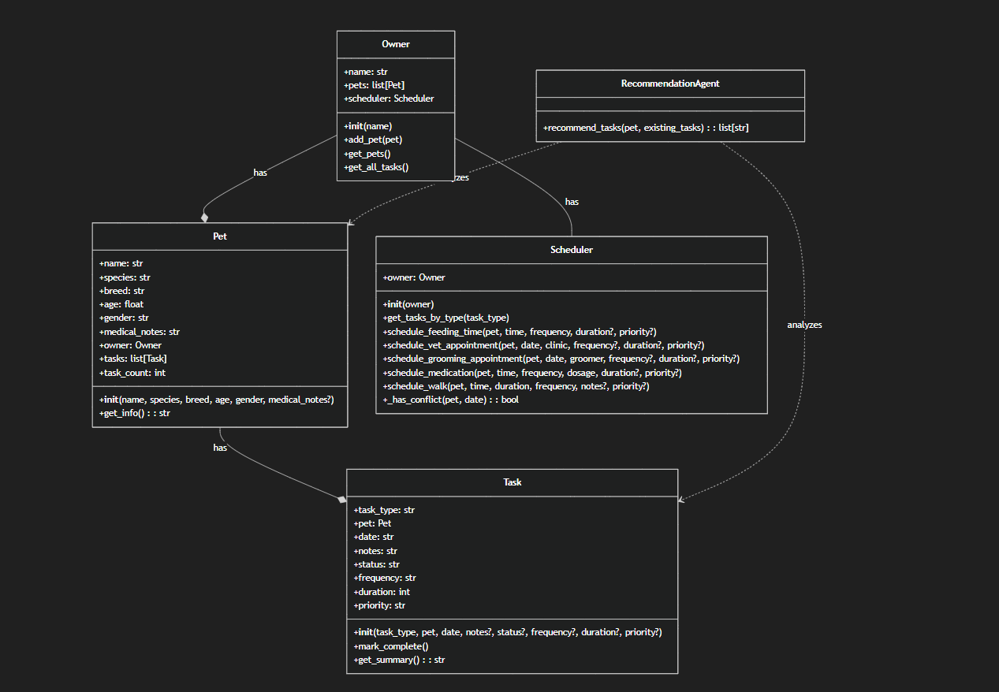

# PawPal+ Project Reflection

## 1. System Design

# Three core requirements:
1. Add a pet
2. Create tasks (feeding, medications, walk, vet/grooming appointment) and schedule them
3. Edit tasks
4. Have an agent recommend proper pet care based on pet care history 

**a. Initial design**

- Briefly describe your initial UML design.
    - The app should have classes such as Owner, Pet, and Scheduler. Owner owns the pet and uses the scheduler to schedule the tasks. 
- What classes did you include, and what responsibilities did you assign to each?
    - Owner should have the name of the person who the pet(s) belong to and it should have the name of the person and the name of the pets 
    - Pet class should hold values like the name of the pet, species of pet, breed, age, etc
    - Scheduler class should have 3 methods for feeding schedule, vet appointment, and possibly grooming appointment 

**b. Design changes**

- Did your design change during implementation?
    - These are the changes it suggested 
    
        - I implemented all the changes because it made sense, except remove_pet() and instead I deleted remove_pet() method for now. Removing a pet could be an option for the future because someone could give away their pet or it could pass away, but I won't be considering that for now. 
- If yes, describe at least one change and why you made it.
    - Removing a pet could be an option for the future because someone could give away their pet or it could pass away, but I won't be considering that for now.

---

## 2. Scheduling Logic and Tradeoffs

**a. Constraints and priorities**

- What constraints does your scheduler consider (for example: time, priority, preferences)?
    - My scheduler consider priority and duration (time). 
- How did you decide which constraints mattered most?
    - Priority should matter more. I could create a rule to determine task by weighing priority againts duration. A high priority task has take more than an hour will be less than a medium priotory task that takes 15 minutes. 

**b. Tradeoffs**

- Describe one tradeoff your scheduler makes. 
    - 
- Why is that tradeoff reasonable for this scenario?

---

## 3. AI Collaboration

**a. How you used AI**

- How did you use AI tools during this project (for example: design brainstorming, debugging, refactoring)?
    - I used AI to summarize the system and ask for suggestions to make the system more robust. 
- What kinds of prompts or questions were most helpful?
    - Asking specific question with context. 

**b. Judgment and verification**

- Describe one moment where you did not accept an AI suggestion as-is.
    - The AI suggested to add more criteria in the has_conflict method scheduler other than the date like the type of task, but for now, I believe date as the only check for conflict is sufficient. 
- How did you evaluate or verify what the AI suggested?
    - I realized it adds complexity without much value. 

---

## 4. Testing and Verification

**a. What you tested**

- What behaviors did you test?
    - I tested that the scheduler method works properly
- Why were these tests important?
    - these tests are important to show the app is functioning for what it supposed to do. 

**b. Confidence**

- How confident are you that your scheduler works correctly?

    - It should work well and I estimate it to be over 90%. There are edge cases that I may come across if I were to do more tests. 
- What edge cases would you test next if you had more time? 
    - I would test adding the same task twice 

---

## 5. Reflection

**a. What went well**

- What part of this project are you most satisfied with?

**b. What you would improve**

- If you had another iteration, what would you improve or redesign?

**c. Key takeaway**

- What is one important thing you learned about designing systems or working with AI on this project?

# UML Diagram:

I implemented many features that I didn't implement before. I made the pawpal_system.py more robust and linked its integration with streamlit UI. 

I added a recommendation agent based on simple rule-based system to recommend future tasks for better pet care. 

# Recording
https://www.loom.com/share/e8f7d4515c324c90bce4a50d7d5a9e33